# pixeldart

> Current checkout note — 2026-08-09: the concrete `SceneRendererImpl`
> bootstrap, safe graph, retained-world lifecycle, material-v2 bindings,
> capability serialization,
> and context-restore path are present. The command and status guidance below
> describes this checkout, including its deliberately explicit remaining gaps.

The name is misleading — this is a full-blown retained-scene **3D renderer for the browser, written in pure Dart on WebGL2**. No Flutter, no engine dependency, no third-party math/ECS/asset library. The only runtime dependency is `package:web`, and it is confined to a single backend directory by a mechanically enforced import boundary.

It renders a modern deferred-flavored pipeline — shadow mapping, depth prepass, SSAO, MRT emissive + bloom, depth of field, LUT color grading — and then deliberately ruins it with a faithful PS1/VHS-era treatment: vertex snapping, affine texture warp, color quantization with ordered dithering, and a six-component VHS recording stage with real frame-to-frame ghosting.

```text
shadow map ─▶ depth prepass ─▶ SSAO (half-res) ─▶ world (MRT: color + emissive)
  ─▶ volumetric media (12-step half-res) ─▶ transparent / particles
  ─▶ MSAA resolve ─▶ volumetric composite ─▶ bloom ─▶ DOF ─▶ LUT grade
  ─▶ PS1 quantize + dither ─▶ VHS ─▶ NEAREST present
```

The high-quality profile now includes a bounded participating-media path. It
integrates height-weighted fog against the authoritative depth prepass, applies
Henyey–Greenstein phase scattering for the sun or moon, and ranks up to four
host-provided practical or lightning sources by influence. The low-resolution
result is additively composited only after the MSAA resolve, so shafts respect
occluders without changing the safe profile or claiming unsupported features.

## Quickstart — a host in thirty lines

```dart
import 'package:pixeldart/pixeldart.dart';
import 'package:pixeldart/pixeldart_advanced.dart';
import 'package:pixeldart/rendering/webgl/webgl2_renderer_factory.dart';

final renderer = const WebGl2RendererFactory().create(canvas)!;

// The backing store follows the device pixel ratio; you do not compute it.
final surface = SurfaceMetrics.forCanvas(
  cssWidth: canvas.clientWidth,
  cssHeight: canvas.clientHeight,
  devicePixelRatio: window.devicePixelRatio.toDouble(),
);

// Tries the requested profile, descends to safe, and tells you what happened.
final boot = await bootstrapRenderer(
  renderer: renderer,
  surface: surface,
  ladder: defaultProfileLadder(QualityProfile.clean),
  configurationFor: (profile) => RendererConfiguration(
    profile: profile,
    internalWidth: 1280,
    internalHeight: 720,
  ),
);
if (boot.didFallBack) print(boot.fallbackReason);

final world = renderer.createWorld();
final frames = FrameSequencer();

// Per frame: the camera derives its own matrices, the sequencer owns the
// frame index, history epoch, and noise seed.
renderer.beginFrame(world, frames.next(
  camera: CameraView.look(
    eye: Vec3(0, 1.6, 4),
    forward: Vec3(0, 0, -1),
    fovYRadians: 1.0,
    aspect: surface.pixelWidth / surface.pixelHeight,
    near: 0.1,
    far: 100,
  ),
  environment: const FrameEnvironment(clearColor: LinearColor(0.03, 0.03, 0.04)),
  post: PostProcessState.off,
  timeSeconds: elapsed,
));
renderer.endFrame();

// After anything that rebuilds the graph, so temporal effects stop
// reprojecting against history that no longer describes the scene:
frames.invalidateHistory('surface resized');
```

`web/minimal/` is this program complete and runnable, and is the file to copy
from. Four things there are deliberately *not* hand-written, because every host
that hand-wrote them got at least one wrong:

| Instead of | Use | What it prevents |
| --- | --- | --- |
| `try { initialize(high) } catch { initialize(safe) }` | `bootstrapRenderer` | a silent downgrade nobody reports to the player |
| `pixelWidth: cssWidth` | `SurfaceMetrics.forCanvas` | rendering at 1x on every HiDPI display |
| `viewProjection: projection * view` | `CameraView.look` / `.lookAt` | culling and shading disagreeing about where the camera is |
| `frameIndex++`, `historyEpoch` by hand | `FrameSequencer` | stale temporal history after a resize |

The raw constructors remain available for hosts that genuinely own an unusual
projection or an external camera rig. `CameraView.validate()` now rejects a
`viewProjection` that is not `projection * view`, so the raw path is checked
rather than merely available.

## Use Pixeldart as a library

Pixeldart is independently usable. A host does not need *The Quarantine*, its
rooms, story, save format, DOM, audio, or input system. Import
`package:pixeldart/pixeldart.dart` for the stable renderer-facing facade and
submit retained scene resources plus immutable frame facts. Import
`package:pixeldart/pixeldart_advanced.dart` when the host deliberately owns
backend policy such as capability negotiation, residency, or pass planning.
Browser hosts additionally bind the WebGL2 adapter at their platform edge;
that adapter is intentionally not loaded by VM-only hosts.

The stable facade contains contracts, handles, math, model packages, and
diagnostics. It does not expose game types or require browser globals. WebGL
construction and generated shader details stay behind the implementation
boundary, so another Dart/WebGL host can use the same package and receive the
same explicit capability, lifecycle, and degradation diagnostics.

The game is one downstream host and its integration evidence is separate from
the renderer's own package tests. Pixeldart must never infer story or room
meaning from asset names, and the game must never parse renderer package
internals in browser gameplay code.

To verify the installation boundary, run `dart run
tools/test_plib01_clean_downstream.dart`. The check creates a temporary neutral
Dart package, resolves Pixeldart by path, and analyzes a host that imports only
the stable facade. The lifecycle fixture is separate:
`dart run tools/test_plib03_downstream_host.dart` exercises a generic scene,
resize, context loss/restore, and disposal against a deterministic fake device.

Atmospheric fields expose renderer-only diagnostics through the same stable
facade. Resolve a profile budget with
`AtmosphericParticleBudget.forProfile`, construct the field with its effective
count, then call `field.diagnostics(frame, budget: budget)`. The returned
snapshot reconciles requested/effective counts, cap state, frustum visibility,
and average particle speed. A mismatched host count is rejected; Pixeldart
does not infer weather, room exposure, or impact meaning.

`FlowPath`/`FlowParticleField` is the complementary world-space stream
contract. A host can submit deterministic paths for roof runoff, drains, leaks,
or other phenomena without teaching Pixeldart what the path means. The game
uses this for capacity-limited rain flow; the renderer supplies only the
resource, blend, culling, and lifecycle behaviour.

The cinematic pipeline is seventeen passes, including volumetric integration
and composite; the established stylized `ps1Full` profile remains a pinned
15-pass variant without media.

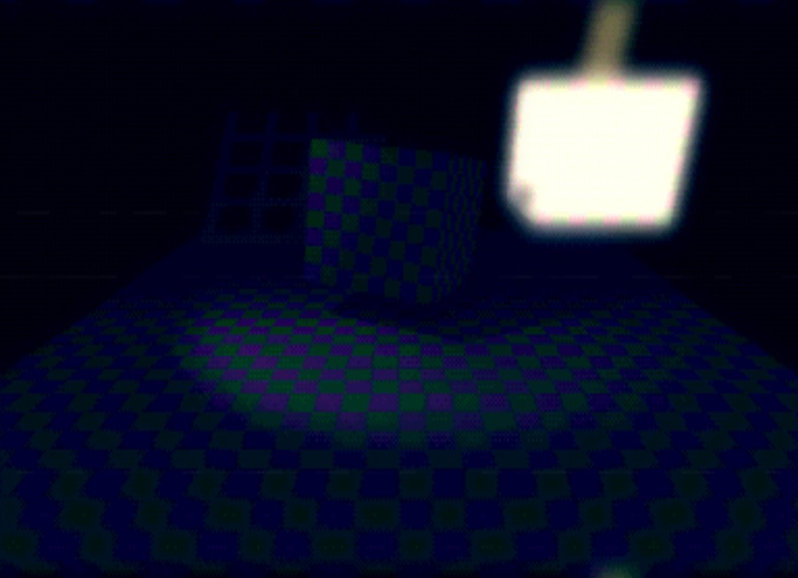

### Capability evidence at a glance

These are real standalone-demo captures, selected as a quick visual tour of
the renderer's most failure-prone seams: lighting and contact occlusion,
post-processing, cutout geometry, and back-face/depth agreement.

| Lighting + post | Geometry + material contracts |
| :---: | :---: |
|  | 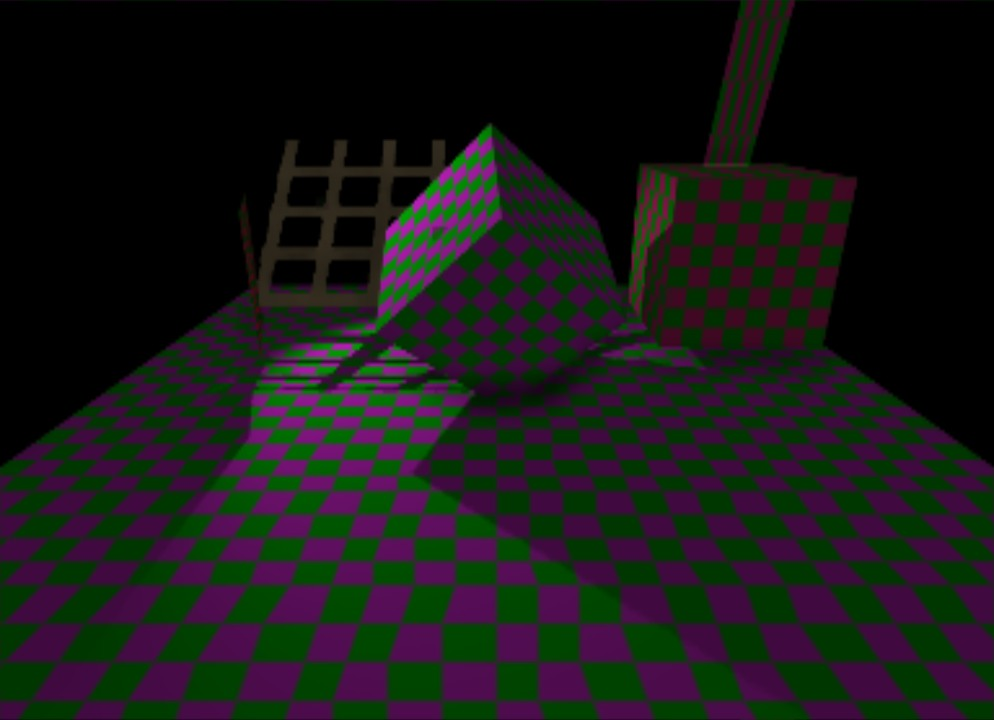 |
| **Full stack** — the graph composes all optional stages | **Alpha mask** — world, depth prepass, and shadow caster agree |
| 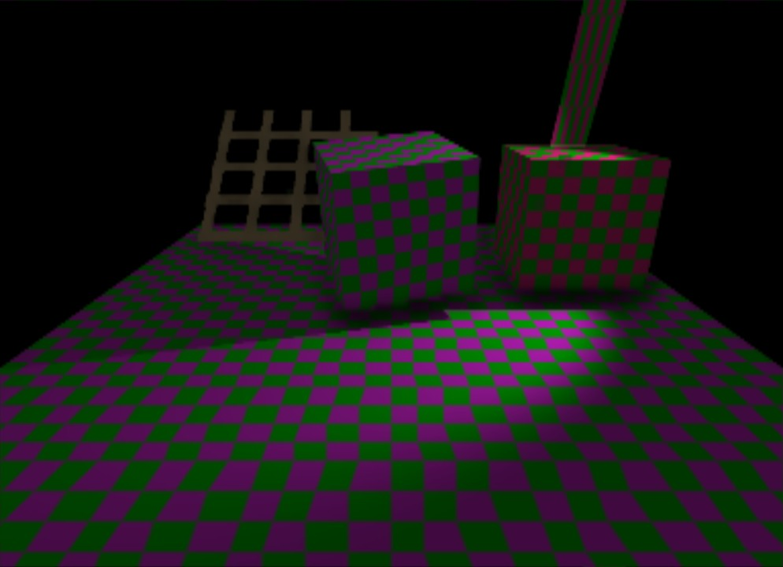 | 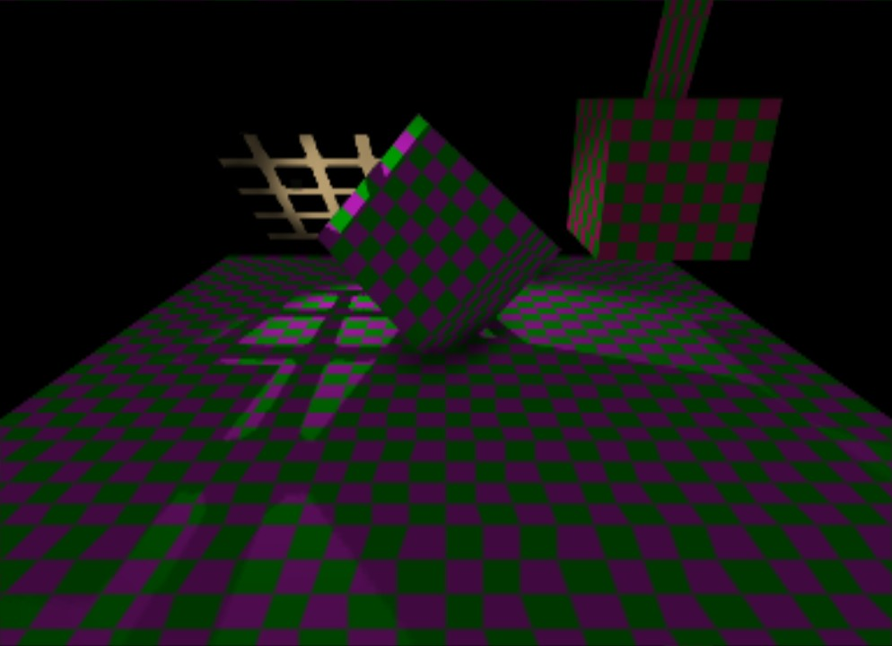 |
| **Raw geometry** — a useful baseline for A/B captures | **Double-sided material** — culling is a per-material override |

The gallery below keeps the same camera and scene while changing one switch at
a time, so the images are evidence of a live feature boundary rather than
decorative mockups.

## What makes the finished renderer special

Pixeldart is being finished as a renderer that is beautiful because it is
well-behaved, not because it hides complexity behind a spectacular screenshot.
Its defining promise is that a host application can submit a scene, lose the
GPU context, run on a weaker adapter, load a large model, and still understand
exactly what the renderer did and why.

The finished renderer brings several qualities together:

- **A retained scene that respects time.** Static geometry, materials, textures,
  instances, and world items stay registered. A frame submits changing facts—
  transforms, visibility, lights, environment and effects—rather than rebuilding
  the world or re-uploading every prop.
- **Correctness before decoration.** The render graph validates resource order,
  attachment formats, history, resolves, capabilities and pass dependencies
  before the first draw. Depth, world, shadow and alpha-mask paths share the
  same material meaning, so a cutout does not become solid in its shadow or
  disappear from the depth prepass.
- **Graceful degradation with no fake promises.** Safe and reduced profiles are
  real renderer configurations, not labels attached to a high-quality frame.
  Unsupported HDR, anisotropy, shadows, timers or optional effects produce an
  explicit effective configuration and reason. The safe world-to-present path
  remains available when an optional feature fails.
- **Resources that can be trusted.** Typed generation-checked handles reject
  stale use, double release and draw-after-release. CPU descriptors survive
  context loss, GPU objects are rebuilt in a known order, and repeated attach,
  resize, LOD and restore cycles must return live-resource counts to zero.
- **A coherent image.** Linear colour handling, authored tangent bases, normal
  maps, ORM channels, emissive energy, alpha modes, contact grounding, bounded
  direct lights and shadow selection are parts of one contract. PS1/VHS treatment
  is layered after that clean image; it is an authored presentation choice, not
  a filter used to conceal broken geometry or lighting.
- **Assets that arrive with evidence.** glTF/GLB and normalized model packages
  carry hashes, bounds, material slots, LODs, sockets, provenance and licence
  records. The renderer can reject malformed or incomplete content before GPU
  allocation instead of silently turning a missing surface into an unexplained
  white box.
- **Determinism that helps both people and machines.** The host owns time,
  frame index, history invalidation and random seed. The same resolved inputs
  produce the same CPU decisions, diagnostics and fake-device trace, while real
  WebGL captures prove the pixels and driver behaviour that a fake device cannot.
- **A renderer that does not become the game.** Pixeldart does not own input,
  physics, rooms, story, saves, audio or UI. Any Dart/WebGL2 host can provide
  immutable frame facts and retained-scene commands without importing game code.

That combination is the point: Pixeldart aims to make high-fidelity rendering
feel dependable to the application around it. A finished feature is not merely a
shader that works once; it has a declared contract, a safe fallback, lifecycle
ownership, diagnostics, fake-device coverage, and a real-browser proof path.
The result is a renderer that can be used for a distinctive game today and still
be a credible open framework for a different application tomorrow.

## Showcase

Every effect in the stack, isolated by turning it off against the same scene. Left/right pairs are live captures from the demo (`web/renderer_test/`).

| | |
| :---: | :---: |
|  |  |
| **Everything on** | **Post chain off** — raw lit geometry underneath |
| 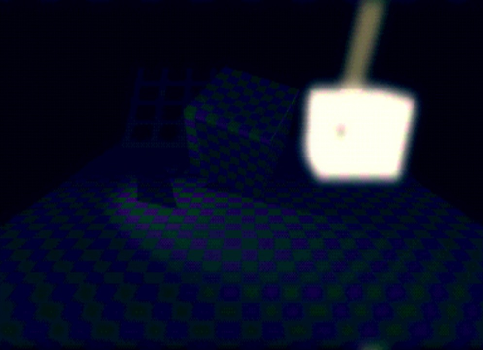 | 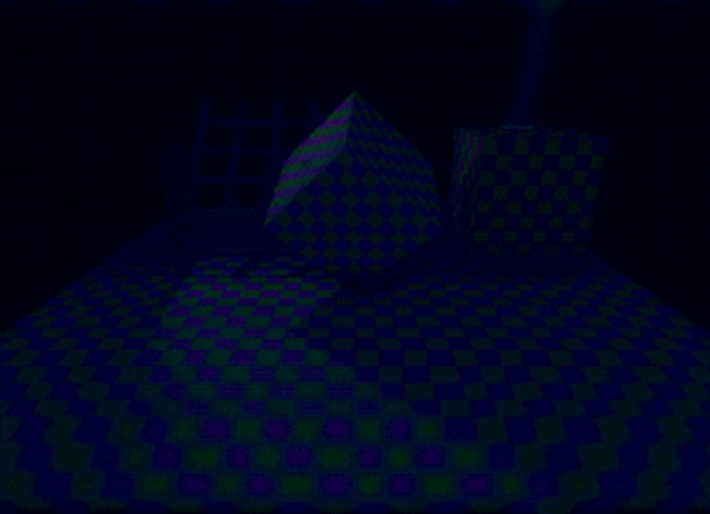 |
| **SSAO off** — contact shadows in creases vanish | **Bloom off** — emissive cores stop glowing |
| 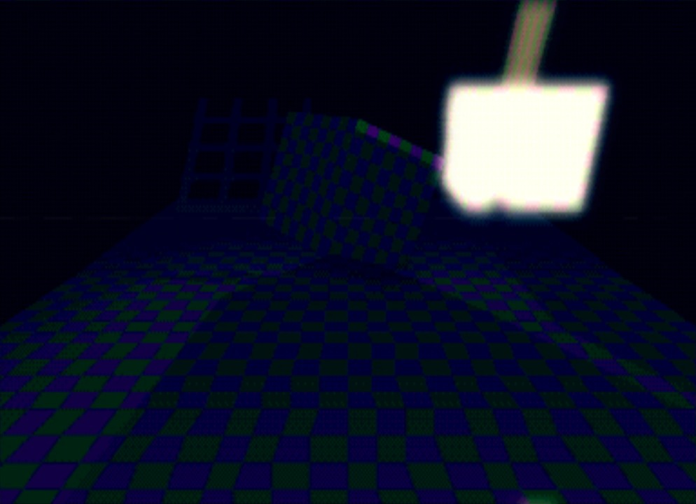 | 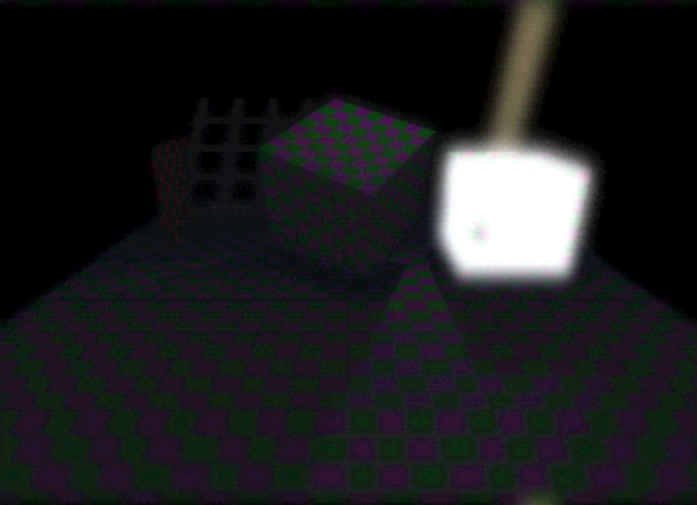 |
| **DOF off** — background snaps into focus | **Grade off** — the LUT's cast removed |
| 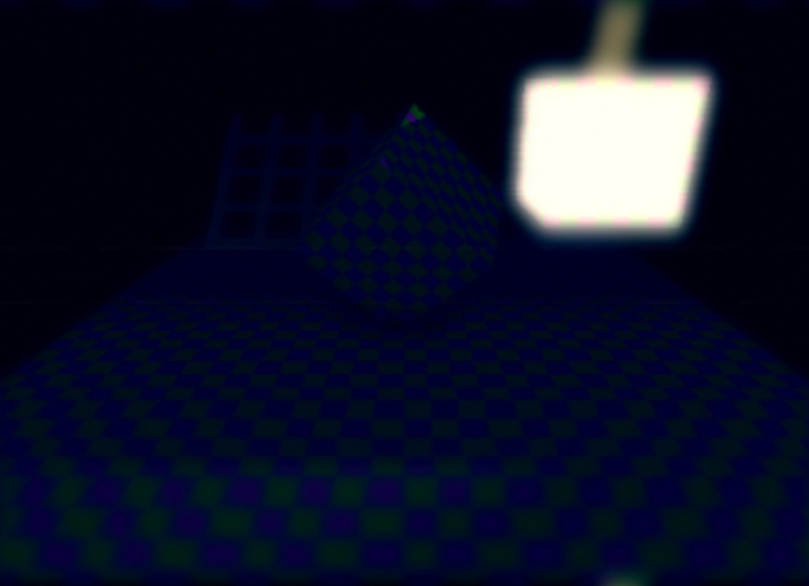 | 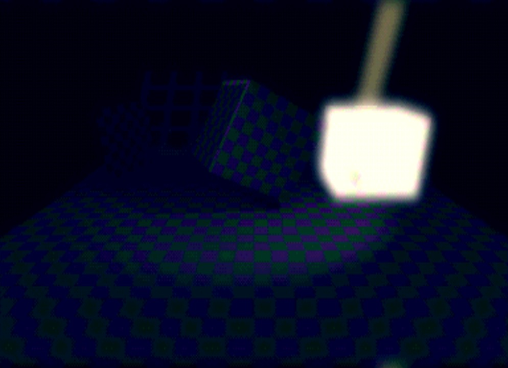 |
| **PS1 off** — no quantize, dither, or vertex snap | **VHS off** — no chroma bleed, tracking, noise, ghosting |
| 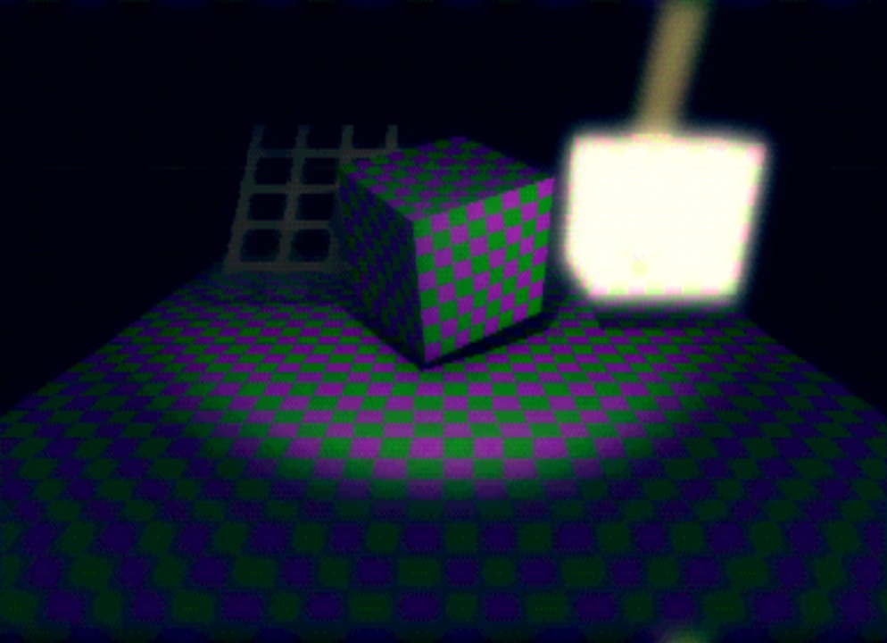 | 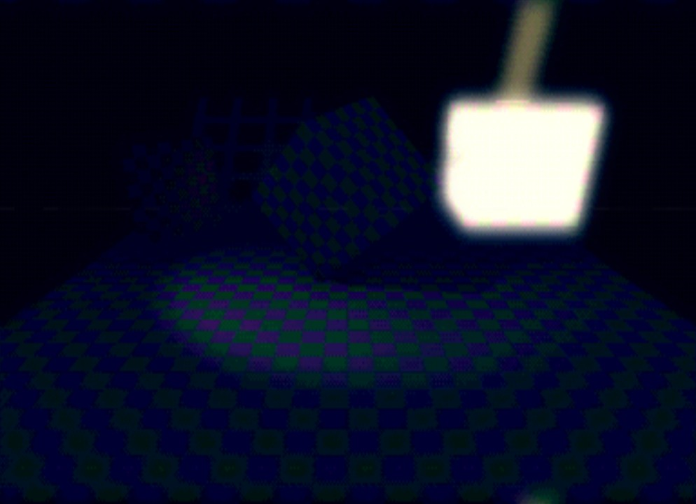 |
| **Fog off** | **Affine UV off** — perspective-correct sampling restored |
| 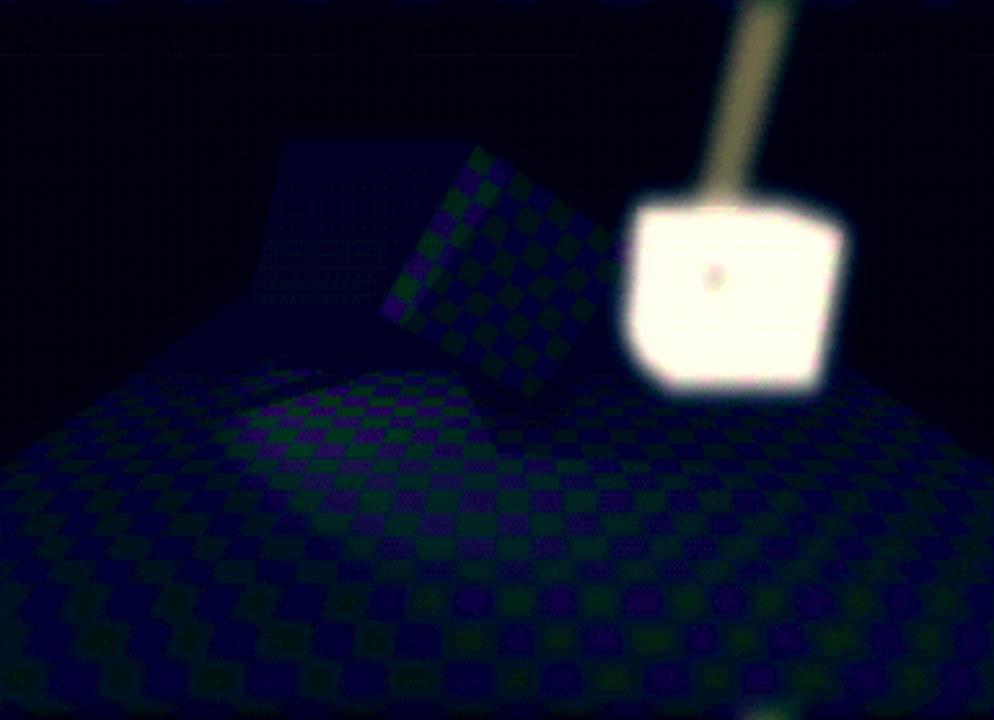 |  |
| **Alpha mask off** — the lattice becomes a solid quad | **Masked shadows** — the cutout pattern reaches the shadow caster |
| 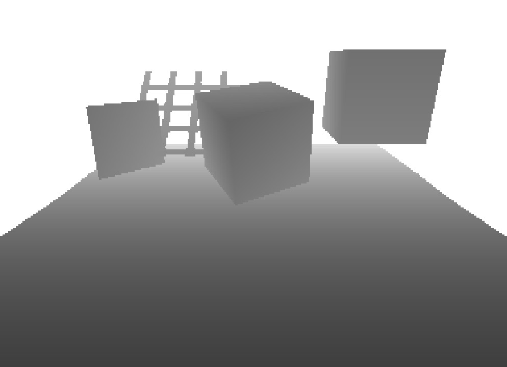 | 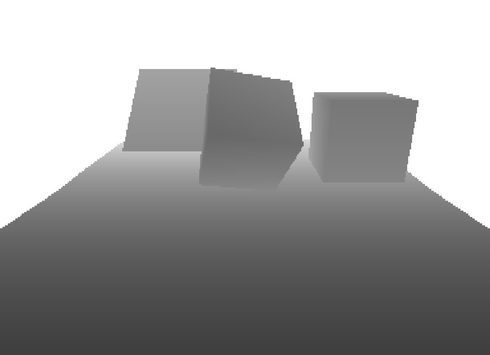 |
| **Depth prepass debug** — masked texels cut out of the prepass too | **Same view, mask off** — the lattice depth goes solid |

<details>
<summary>Two more pairs</summary>

| | |
| :---: | :---: |
| 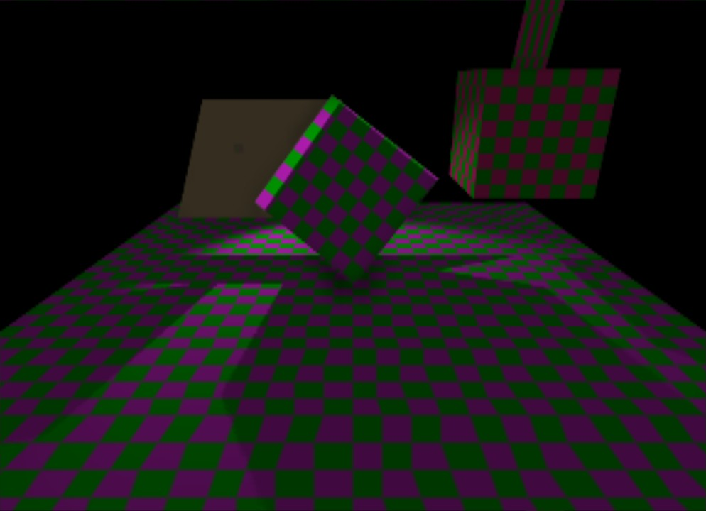 | 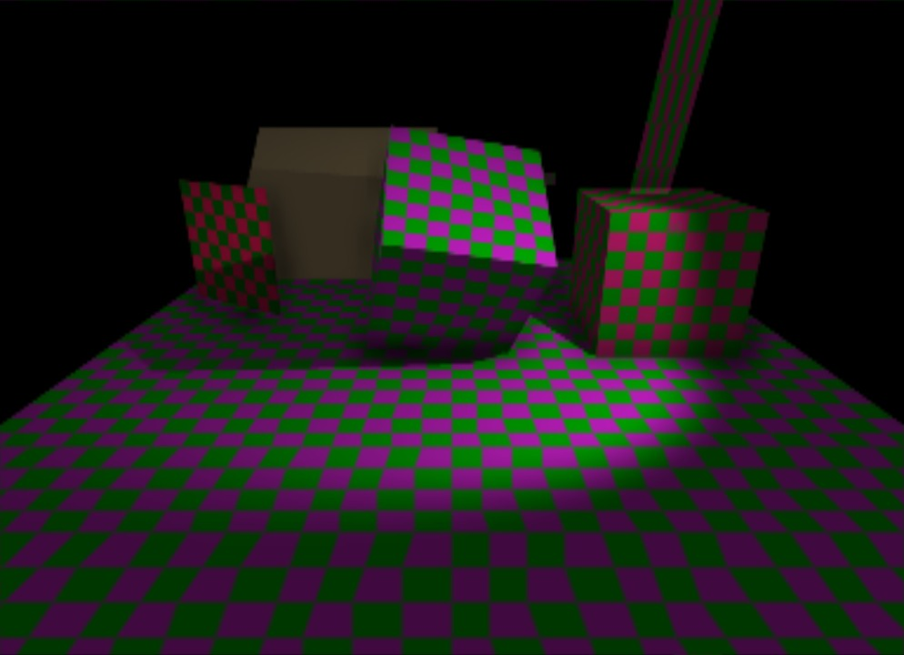 |
| **Lattice shadow with masking off** — a solid quad's shadow | **Post chain and mask both off** |

</details>

### Additional captures

These two captures cover the remaining back-face/depth-prepass cases in the
checked-in gallery. They are useful when changing culling, double-sided
materials, or the alpha-mask path:

| | |
| :---: | :---: |
|  | 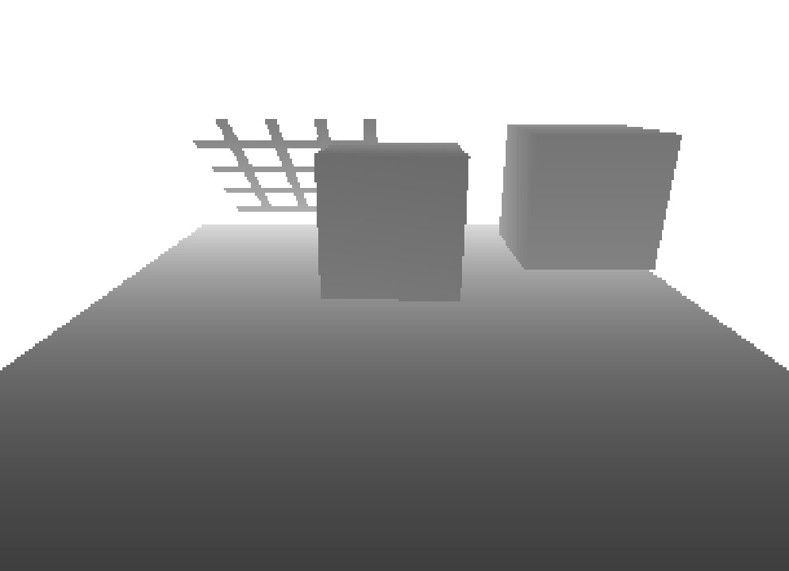 |
| **Double-sided panel** — the back face is intentionally shaded | **Depth-prepass view** — the same back face remains represented in depth |

All gallery images are existing captures from the standalone renderer demo;
they are feature-isolation evidence, not screenshots generated by a mockup.

### Shared screenshot contract

Current review captures use the repository-wide browser bundle contract:
lossless `browser-*.png` plus `.json` metadata and `.digest.json` SHA-256
sidecars. The three current Pixeldart states are:

| State | Capture |
| --- | --- |
| Three R-09 instances | [PNG](.github/screenshots/browser-pixeldart-r09-three-instances.png) · [metadata](.github/screenshots/browser-pixeldart-r09-three-instances.json) · [digest](.github/screenshots/browser-pixeldart-r09-three-instances.digest.json) |
| All standalone features | [PNG](.github/screenshots/browser-pixeldart-demo-all-features.png) · [metadata](.github/screenshots/browser-pixeldart-demo-all-features.json) · [digest](.github/screenshots/browser-pixeldart-demo-all-features.digest.json) |
| Depth debug | [PNG](.github/screenshots/browser-pixeldart-demo-depth-debug.png) · [metadata](.github/screenshots/browser-pixeldart-demo-depth-debug.json) · [digest](.github/screenshots/browser-pixeldart-demo-depth-debug.digest.json) |

These are documentation/review captures, not golden replacements. They are
generated by [`tools/browser/capture_pixeldart_gallery.cjs`](../../tools/browser/capture_pixeldart_gallery.cjs);
the full game-and-renderer rules live in
[`tools/browser/SCREENSHOT_CONTRACT.md`](../../tools/browser/SCREENSHOT_CONTRACT.md).

Gallery index: [all features](.github/screenshots/00-all-features-on.jpg) ·
[SSAO off](.github/screenshots/01-ssao-off.jpg) ·
[bloom off](.github/screenshots/02-bloom-off.jpg) ·
[DOF off](.github/screenshots/03-dof-off.jpg) ·
[grade off](.github/screenshots/04-grade-off.jpg) ·
[PS1 off](.github/screenshots/05-ps1-off.jpg) ·
[VHS off](.github/screenshots/06-vhs-off.jpg) ·
[fog off](.github/screenshots/07-fog-off.jpg) ·
[affine UV off](.github/screenshots/08-affine-uv-off.jpg) ·
[alpha mask off](.github/screenshots/09-alpha-mask-off.jpg) ·
[depth debug](.github/screenshots/10-depth-prepass-debug.jpg) ·
[depth debug, mask off](.github/screenshots/11-depth-prepass-debug-alpha-mask-off.jpg) ·
[geometry only](.github/screenshots/12-post-chain-off-geometry-only.jpg) ·
[geometry only, mask off](.github/screenshots/13-post-chain-off-alpha-mask-off.jpg) ·
[lattice shadow](.github/screenshots/14-lattice-shadow-alpha-mask-on.jpg) ·
[lattice shadow, mask off](.github/screenshots/15-lattice-shadow-alpha-mask-off.jpg) ·
[double-sided back face](.github/screenshots/16-double-sided-panel-back-face-shaded.jpg) ·
[back-face depth prepass](.github/screenshots/17-double-sided-panel-back-face-depth-prepass.jpg).

## Highlights

- **Validated render graph.** Passes declare typed, versioned resource edges; the whole graph is validated *before the first draw*, never mid-frame. Nine distinct failure kinds (read-before-write, duplicate writers, sampling a multisampled attachment, invalid resolve, format/size mismatch, undeclared same-version read/write, history read without a valid previous frame, dependency cycles, missing capability) — each with its own test fixture. An invalid optional feature builds *zero* passes, not just its own.
- **A mandatory safe graph.** A minimal world → present path using vertex color and fallback textures that must keep rendering through missing textures, failed optional shaders, low capabilities, resize, and context restoration. Everything fancier is layered on top and allowed to fail without taking geometry down with it.
- **Typed, generation-checked GPU handles.** Public handles are logical slot + generation references; stale handles, double release, and draw-after-release are rejected, not undefined. Backend GPU objects additionally carry a private *device epoch*, so a logical mesh handle survives WebGL context loss while an old-epoch GPU object is correctly refused.
- **One backend seam.** Everything above `GpuDevice` is backend-agnostic. Two implementations exist: the real `WebGl2Device`, and a first-class `FakeGpuDevice` that records call order, uniform values, and per-kind resource counts — which is how graph validation, resource lifecycles, loss/restore cycles, and resize handling are proven without a browser.
- **Caller-owned time and determinism.** The renderer receives `timeSeconds`, `frameIndex`, `noiseSeed`, and `historyEpoch` — it never reads a wall clock, accumulates `dt`, or derives randomness from allocation order. Temporal history (VHS ghosting) is invalidated by the caller bumping `historyEpoch`; there is no second reset API.
- **Declared GL state.** Each pass's complete GL state (depth, cull, blend, color mask, scissor) lives in its `PassDescriptor`; a pass cannot add state at execute time that its descriptor did not name. Blend state is per-item, not per-pass — opaque, alpha, and additive draws select their preset inside the draw loop.
- **State-cache diffing.** `WebGlStateCache.diff()` is pure set-difference logic, so the backend only issues GL state calls for fields that actually changed.
- **Zero-cost-off.** SSAO, bloom, and DOF read their per-frame weight and skip their draw calls entirely at zero — distinguishing "profile-disabled" (nothing allocated) from "installed but inactive this frame" (targets warm, zero draws) as a testable contract.
- **Concrete renderer facade.** `SceneRendererImpl` now owns device lifecycle,
  retained worlds, mesh/material/texture resources, safe-graph execution,
  frame legality, deterministic frame statistics, disposal, and context-restore
  rehydration. Capability negotiation remains in the WebGL adapter.

## What is implemented and browser-confirmed

| Area | Features |
| --- | --- |
| World | Indexed meshes with Uint16/Uint32 element buffers, per-pass draw state, depth test, backface culling, per-draw material tint, double-sided override, texture sampling with mipmaps, alpha-masked cutout (`discard` in world, depth-prepass, *and* shadow-caster paths) |
| Materials | Material-v2 UV scale/offset, albedo/normal/ORM/emissive/lightmap slots, derivative or authored TBN normal mapping, linear ORM channels, emissive MRT glow, alpha modes, neutral fallback maps, and validated sampler policy |
| Lighting | Directional + ambient, four point slots, a selected shadow caster plus three direct spot slots with distance/cone falloff, deterministic nine-tap PCF with slope-scaled bias and host-controlled weather softness; volumetric shafts consume the frame's resolved directional light, fog density, and deterministically ranked practical/lightning source slots rather than a hidden global light |
| Depth | Single-sample depth prepass shared by SSAO/DOF, linearized depth debug view |
| AO | Half-resolution 8-sample SSAO reconstructing position from depth and normals from derivatives, depth-aware bilateral blur, modulates ambient only |
| Emissive | Real MRT (`COLOR_ATTACHMENT1`), driven by material emissive texture × strength — never inferred from final luma — surviving explicit MSAA resolve |
| Output | Explicit MSAA resolve, scene-linear exposure/Reinhard tone map, selectable linear/sRGB output encoding, and configuration-scoped resource extents |
| Post | Bloom (separable gaussian, additive composite), DOF (circle-of-confusion vs. focus distance/range), 3D-LUT color grade, analytic exponential height-fog optical depth plus distance control (never applied to emissive), depth-weighted near-surface wetness, and host-resolved upward snow coverage plus lingering material dissolution driven by `PostProcessState` before the specular BRDF; precipitation is physical world geometry, never a full-screen rain overlay |
| Media | Public bounded participating-media helpers: exact exponential height-fog optical depth/transmittance, ray-box local media, validated point-light in-scattering, aggregate practical/lightning source fields, source-aware inverse-square transient radiance, and a spatial thermal dissolution field with CPU/shader-matched exponential falloff; hosts own source lifetimes and weather semantics |
| Solar cycle | Latitude/declination-based sun elevation and azimuth, explicit astronomical/nautical/civil/golden-hour phases, polar day/night handling, continuous cloud/aerosol transmittance, smooth twilight and apparent-horizon visibility factors for refracted sunrise/sunset transitions, and weather-coupled direct light and fog facts; the host supplies time and location |
| Participating medium | `FrameEnvironment.volumetric*` and `VolumetricLightFeature`: camera-accurate inverse-projection rays, bounded stratified ray integration, authored medium albedo/height falloff/near-field dust density/anisotropy/jitter, and deterministic source selection for practicals and lightning |
| Reflections | Deterministic glossy/wet reflection weighting with Schlick Fresnel, roughness LOD, medium transmission, and explicit screen-space-hit versus probe-fallback state; the resolver never fabricates a hit or scene probe |
| PS1 | Vertex snapping in NDC before the perspective divide, affine UV warp (solved without `noperspective`, gated per material × per frame), color quantization to N bits with Bayer 4×4 ordered dithering |
| VHS | Final recording stage with six independent weights — chroma bleed, tracking jitter, YIQ tape noise, head-switch tear, dropout streaks, frame ghosting via the graph's history/ping-pong mechanism |
| Transients | Frame-local particle submission (gravity/drag-aware, velocity-aligned rain, alpha motes, additive light shafts, world-space flow paths) through a persistent grow-only encoder, sorted back-to-front; deterministic per-particle kinematics are available to hosts for collision/impact decisions |
| Wet/fire response | Host-owned roof runoff and drain paths remain generic `FlowPath` data; wet coverage drives a bounded water clearcoat/grazing reflection, while independent atmospheric fields can render hot flame, pale vapour, and dark soot without renderer-owned combustion semantics. The host can vary smoke lifetimes with moisture, oxygen starvation, and wind so plumes linger or disperse physically |
| Accessibility | `reducedMotion` halves VHS motion weights and disables ghosting before any uniform reaches a shader |

Everything above is implemented in the standalone demo. The checked-in
gallery records feature-isolation captures from that demo, including the
double-sided and depth-prepass cases. The VM suite does not replace a live
browser/driver run: rerun the demo on the target adapter before treating
context-loss, resize, performance, or accessibility results as current
acceptance evidence.

## Start here

Pixeldart is a Dart package, not a Flutter package. The supported runtime is a
browser with WebGL2. The package itself has one runtime dependency:
`package:web`.

### Install and run the checks

From this directory:

```sh
dart pub get
dart analyze
dart run tools/renderer/test_all.dart
dart run tools/renderer/check_boundary.dart
dart run tools/renderer/check_sizes.dart
dart run tools/renderer/shaders.dart --check
dart run tools/test_package_boundaries.dart
```

`test_all.dart` discovers and runs all 51 renderer fixtures. It resolves the
package root from its own script path, so the aggregate is safe to invoke from
the repository root or this package directory. The fixtures run on the Dart VM
against `FakeGpuDevice`; this is fast, deterministic contract evidence and is
not a substitute for a real browser/driver run.

### Run the standalone browser demo

Prerequisites: Dart SDK `3.12.x` (the current acceptance build uses 3.12.2),
Python 3, and a WebGL2-capable browser.

```sh
dart pub get
dart compile js web/renderer_test/main.dart -o web/renderer_test/main.dart.js -O2
python3 -m http.server 8090 --directory .
```

Open `http://127.0.0.1:8090/web/renderer_test/`. The demo is a
self-contained composition root: spinning textured cubes, an orbiting spot
light with live shadows, a subdivided ground plane, motes and light shafts,
and a debug panel that logs every subsystem decision. Live toggles:

| Key | Toggles |
| --- | --- |
| `D` | Depth debug view |
| `F` | Depth of field |
| `G` | Color grade LUT |
| `P` | PS1 quantize + dither + vertex snap |
| `V` | VHS |
| `H` | Fog |
| `S` | SSAO |
| `B` | Bloom |
| `A` | Affine UV warp |
| `M` | Alpha-masked cutout material |

The demo currently exercises the feature graph directly so that every pass can
be inspected. It is intentionally more verbose than the reusable facade.

For the renderer-only R-09 correctness probe, append
`?r09-instances=1` to the demo URL. The canvas then renders only three shared
opaque cube items, publishes their distinct transforms, reads back a small
pixel neighborhood at each projected center, and exposes
`data-instance-pixel-proof="three-distinct"` when all three are visible. The
browser smoke harness also wraps `drawElementsInstanced` and requires an
actual call with `instanceCount === 3`:

```sh
PIXELDART_INSTANCE_BASE_URL=http://127.0.0.1:8090/web/renderer_test/?r09-instances=1 \
  node ../../tools/browser/pixeldart_instance_smoke.cjs
```

This fixture uses only the standalone cube mesh/material; it does not load
house inventory, exterior cells, or PVS data.

### R-09 package texture-residency draw proof

The standalone demo also exposes `?r09-residency=1`. It declares a real
`TextureHandle` with no pixels, draws a retained material through the store's
white fallback, then uploads a high-contrast payload into that same
slot+generation handle. The fixture freezes the camera/light and disables the
post chain so the two captures differ only at the material transition. The
canvas publishes `data-r09-texture-residency-status`, `-handle`, `-draw`, and
`-resources`; the browser harness additionally intercepts WebGL texture and
draw calls. It requires `pending`/`fallback-material` first, then
`resident`/`resident-material`, one new `createTexture`, no `deleteTexture`, a
stable logical handle, additional draws, and non-identical PNGs.

From the parent repository, the reproducible browser check is:

```sh
dart compile js external/pixeldart/web/renderer_test/main.dart \
  -o tmp/r09-web/main.dart.js -O2
python3 -m http.server 8092 --directory .
PIXELDART_RESIDENCY_BASE_URL='http://127.0.0.1:8092/tmp/r09-web/?r09-residency=1' \
  node tools/browser/pixeldart_residency_smoke.cjs
```

The standardized pending/resident evidence is checked in beside the other
renderer captures: [pending PNG](.github/screenshots/browser-pixeldart-texture-residency-pending.png) ·
[pending metadata](.github/screenshots/browser-pixeldart-texture-residency-pending.json) ·
[resident PNG](.github/screenshots/browser-pixeldart-texture-residency-resident.png) ·
[resident metadata](.github/screenshots/browser-pixeldart-texture-residency-resident.json).
Their `.digest.json` sidecars carry the same screenshot contract and SHA-256
coverage as game captures. This proves package-level declared-loading and
resident material draws only; asset streaming budgets, actual eviction, and
shadow-capable hardware pixels remain explicitly outside the claim.

### Deterministic per-instance LOD

`ModelPart.lods` remains the authored, half-open distance contract. The exported
`LodSelector` applies an explicit absolute `hysteresisDistance`, and
`InstanceLodSelector` keeps that state independently for each `InstanceId` and
`ModelPart`. A gap or out-of-range distance returns `null` instead of silently
choosing an adjacent level. Selection state is presentation-only: it does not
register, release, or duplicate meshes, materials, textures, or instance
buffers. `tools/renderer/test_lod_selection.dart` exercises boundary behavior,
independent instance state, invalid inputs, and 100 deterministic transition
samples while asserting stable retained-resource/GPU ownership.

### Exterior PVS cell submission (host integration)

The house adapter partitions the indexed exterior shell once into deterministic
cell/material ranges. `ExteriorPvs.filterItems()` selects only the requested
room cells; the Pixeldart runtime updates retained-item visibility masks and
reuses one material per slot, so a room change does not re-register meshes or
instance resources. The runtime publishes
`data-renderer-exterior-cells` and `data-renderer-exterior-items` for later
browser draw telemetry. This is presentation partitioning only: house portals
and collision remain authoritative outside Pixeldart. The house still owns its
authored cell tier; Pixeldart additionally exposes a generic light-distance
shadow-caster policy for hosts that need a renderer-level detail decision.
Neither policy swaps meshes by itself. Asset loading and eviction remain
host-owned around the residency probe.

`TextureResidencyManager` is the explicit retained-texture prewarm seam. It
uses the store's existing fallback-resolve contract, sorts requests by
priority/key, deduplicates shared handles, and reports
`resident`, `pending`, `missing`, or `evicted` without allocating, releasing, or
performing I/O. `ResourceLibrary.textureResidency` exposes the same manager to
host integrations. The focused fixture probes the same working set 100 times,
then releases one handle to prove eviction diagnostics without ownership
churn. The authored-house package probe now publishes
`data-renderer-exterior-texture-bindings` and rejects any submitted exterior
item whose texture is not resident or whose slot+generation handle disagrees
with the retained residency report. Its hall→kitchen evidence keeps the
11/17→6/17 PVS working set and `grime=1.1,wall-plaster=0.1` handles stable;
the deterministic parser/validator lives in
`tools/browser/exterior_pvs_residency.cjs`.

### Generic shadow-caster LOD policy

`ShadowCasterLodPolicy` selects `full`, `reduced`, or `culled` from distance to
the selected `SpotLight`, with explicit hysteresis at both boundaries.
`InstanceShadowCasterLodSelector` keeps that presentation state independently
per retained `InstanceId`; it never registers, releases, or replaces a GPU
resource. Hosts map the tiers to authored caster meshes or skip work, so the
policy does not claim alternate-mesh rendering or browser shadow pixels. The
focused `test_shadow_caster_lod.dart` fixture checks boundary behavior,
light-space distance, invalid inputs, and a 100-frame two-instance ownership
soak. `ShadowFeature` accepts the optional resolver and skips a direct item
only at `culled`; an instanced batch is skipped only when all of its casting
members are culled, preserving conservative batch ownership. The focused
`test_shadow_caster_pass_lod.dart` fixture exercises that seam for 100 frames.

The demo also publishes the real timer-query lifecycle on
`#test-canvas[data-gpu-timing-status]`. With the server running on port 8091,
the repository browser probe checks both a normal headless Firefox context and
an explicit WebGL-disabled context without accepting a duration for
`unsupported`, `pending`, or `disjoint`:

```sh
python3 -m http.server 8091 --directory .
node ../tools/browser/pixeldart_timing_smoke.cjs
```

The probe is capability evidence, not a performance benchmark. A driver that
does expose `EXT_disjoint_timer_query_webgl2` must reach `ready` with a
non-negative elapsed value; otherwise it records `unsupported` honestly.

The bounded R-09 instancing probe uses the same server and verifies three
distinct transforms in real `drawElementsInstanced(..., 3)` calls, three
non-black center neighborhoods, and a screenshot:

```sh
node ../tools/browser/pixeldart_instance_smoke.cjs
```

### Using the game integration

The parent game uses Pixeldart as its only renderer. `?renderer=pixeldart` is
the canonical explicit spelling; stale renderer aliases are rejected. If WebGL2
is unavailable, the canvas reports `renderer-unavailable` with Pixeldart as the
requested backend rather than manufacturing a second renderer. The canvas
exposes the selected backend, executable profile, failure reason, build
provenance, and frame budget through `data-renderer-*` attributes.

The parent game keeps the stable renderer diagnostics fields at the top level
and publishes selection facts under a nested `selection` object. Its keys are
`kind`, `explicit`, `automatic`, `rejected`, and `aliasUsed`, with optional
`rejectionReason` and `aliasReason` strings. A canonical request reports
`kind: "pixeldart"`; stale requests are rejected rather than treated as
accepted renderer choices. Runtime capability failures are published as an
unavailable Pixeldart state.

For example, from the parent repository:

```sh
python3 -m http.server 8090 --directory dist/web
# open http://127.0.0.1:8090/?renderer=pixeldart
```

Keep the query-free URL as the rollback path until the external GPU,
context-loss, accessibility, acoustic, and visual acceptance gates in
`tmp/RENDERER_EXTERNAL_ACCEPTANCE.md` are closed.

If the page is blank, check the browser console first: the demo must be served
over HTTP (opening `index.html` with `file://` prevents module and shader
assets from loading), and the browser must expose WebGL2. Run the shader
freshness check after editing GLSL; generated shader Dart is intentionally
checked in and CI rejects stale output.

## Use Pixeldart from an application

Application code should depend on the public barrel:

```dart
import 'package:pixeldart/pixeldart_advanced.dart';
import 'package:pixeldart/rendering/webgl/webgl2_device.dart';

final device = WebGl2Device(webGl2Context);
final renderer = SceneRendererImpl(device);

await renderer.initialize(
  RendererConfiguration.safe,
  SurfaceMetrics(
    cssWidth: canvasCssWidth,
    cssHeight: canvasCssHeight,
    pixelWidth: canvasPixelWidth,
    pixelHeight: canvasPixelHeight,
  ),
);

final world = renderer.createWorld();
final mesh = renderer.resources.registerMesh(meshData, debugLabel: 'room');
final material = renderer.resources.registerMaterial(
  const MaterialDefinition(key: 'room-wall', tintR: 0.7, tintG: 0.7, tintB: 0.7),
);
final item = world.addItem(
  RetainedItemDescriptor(mesh: mesh, material: material),
);

final encoder = renderer.beginFrame(world, frameInput);
// Optional frame-local geometry:
// encoder.submit(transientDescriptor);
final stats = renderer.endFrame();

// Between frames, not from beginFrame/endFrame:
await renderer.configure(RendererConfiguration.safe);
renderer.resize(nextSurfaceMetrics);

world.removeItem(item);
renderer.dispose();
device.disposeListeners();
```

### Material-v2 authoring

Materials are renderer-neutral data. Optional maps can arrive asynchronously;
until they do, `TextureStore` binds stable neutral pixels (white albedo,
flat normal, identity ORM, black emissive), so missing art cannot make a mesh
disappear. ORM is sampled in linear space as **R = occlusion, G = roughness,
B = metalness**. UV scale/offset and alpha mode are applied consistently by
the world, depth-prepass, and shadow-caster routes. Optional UV1 lightmaps use
a neutral white fallback and explicit per-material intensity; sampler
declarations reject impossible mip/aniso combinations before GPU allocation.

Anisotropy is a request, not a promise. On WebGL2, `WebGl2Device` negotiates
`EXT_texture_filter_anisotropic`, clamps to the extension's reported limit
(with the renderer's 16× authoring cap), applies
`TEXTURE_MAX_ANISOTROPY_EXT`, and retains an `AnisotropyDecision` for
diagnostics. If the extension is absent or reports an unusable limit, the
effective value is deterministically 1×; `usedFallback` makes that downgrade
observable instead of silently overstating quality.
`RenderCapabilities.maxAnisotropy` reports the backend limit used during this
negotiation, while the authoring cap remains 16×.

```dart
final material = renderer.resources.registerMaterial(
  const MaterialDefinition(
    key: 'gothic-oak',
    tintR: 0.72,
    tintG: 0.48,
    tintB: 0.30,
    normalStrength: 0.85,
    roughness: 0.68,
    metallic: 0.0,
    occlusionStrength: 1.0,
    uvScaleU: 2.0,
    uvScaleV: 2.0,
    emissiveStrength: 0.0,
    alphaMode: AlphaMode.opaque,
  ),
);
```

The compatibility vertex layout derives a tangent frame from world-position
and UV derivatives for normal maps. Authored lightmaps belong to the remaining
indirect-light contract; the surface-v2 layout is now available with
tangent4 (handedness in W) and an optional UV1 channel. Mesh upload rejects
non-finite, zero-length, non-orthogonal, or non-±1-handed tangent bases before
they reach a VAO. Compatibility14 meshes retain the deterministic derivative
fallback, keeping old house geometry valid while new assets opt into authored
tangents.

For data-driven models, register the shared mesh/material handles first and
call `ResourceLibrary.bindModel(model)`. The resulting binding view resolves
every part, LOD range, and material variant against the retained stores; it
does not duplicate ownership, and a released handle fails before submission.

The application supplies the actual `MeshData` and `FrameInput`; Pixeldart does
not own a clock, input system, camera controller, game state, save data, or
scene semantics. `FrameInput` must contain a validated finite camera,
environment, post-process state, frame index, history epoch, noise seed, and
time value. `RenderWorld` owns persistent items; `RenderEncoder` owns only
transient items for the current frame.

### Configuration and capability selection

`RendererConfiguration.safe` is the bootstrap profile and is the correct first
configuration for an unknown adapter. The WebGL backend queries capabilities,
validates them, and selects/falls back at the capability boundary. Do not
duplicate that selection in application code. `SceneRendererImpl.configure()`
now prepares replacement GPU targets and programs, validates a candidate safe
graph, swaps it between frames, and disposes the old graph only after the
candidate is ready. Identical configurations are no-ops. The WebGL capability
adapter exposes both the raw negotiated capability profile and the executable
safe/minimal/clean runtime profile; unsupported optional configurations must
downgrade to the safe graph. There is no legacy renderer fallback.
PS1/VHS history ping-pong, live target/canvas resizing, and hardware acceptance
remain separate TODO items.

### Context loss and recovery

`WebGl2Device` installs `webglcontextlost` and `webglcontextrestored` listeners
and calls `preventDefault()` on loss so restoration remains possible.
`SceneRendererImpl` retains CPU-side mesh/texture descriptors, rehydrates GPU
objects, resets stale program handles, rebuilds the safe graph, and preserves
logical resource handles after restoration. Applications should stop submitting
while the device is lost and resume only after the restored event. The fake
device fixtures exercise the deterministic ordering; real browser loss/restore
still requires a hardware/browser run.
Pending GPU timer queries are discarded during loss, abort, and disposal;
polling a sample invalidated by loss returns `GpuTimingStatus.disjoint` rather
than a stale or zero-duration result.

### Diagnostics and release provenance

The renderer exposes capabilities, health, state, and per-frame `FrameStats`.
`FrameStats.drawCalls`, `trianglesSubmitted`, and `instancesSubmitted` are the
successful scene-world submissions recorded at the encoder boundary; culled
geometry is reported separately. `FrameStats.passStats` retains the same
truthful draw/triangle/instance counts for every graph pass, including shadow,
post, and present work, so a performance trace can distinguish scene cost
from a full-screen composite:

```dart
final worldPass = stats.pass('worldOpaqueTransparent');
final presentPass = stats.pass('present');
print('world=${worldPass.drawCalls} draws, '
    'present=${presentPass.drawCalls} draws, '
    'culled=${stats.trianglesCulled} triangles');
```

Transient frame items participate in the same retained-world cull and are
included only when they pass the camera/visibility test. Backend timer-query
results are polled separately because availability is delayed:

```dart
final timing = renderer.pollGpuTiming();
if (timing.status == GpuTimingStatus.ready) {
  print('GPU: ${timing.elapsedNanoseconds} ns for frame ${timing.frameIndex}');
}
```

`pending`, `disjoint`, and `unsupported` are explicit outcomes; none may be
represented as zero-cost GPU work.

Opaque items that share a mesh, material, and authored `instanceFamilyKey` are
batched into bounded groups of 16. The world, textured-world, depth, and shadow
passes upload each member's model matrix (and, where needed, its normal matrix)
to `uInstanceModels`/`uInstanceNormalMatrices`; the vertex shaders select the
matrix with `gl_InstanceID`. Items without a family key use the same passes
with `uUseInstances = 0`, so the representative-model path remains explicit.
The limit is deliberate: two matrix arrays must fit alongside ordinary vertex
uniforms on the WebGL2 minimum budget. The fake-device fixtures verify three
distinct translations and the concrete scene fixture verifies one instanced
world draw with three submitted transforms; real-browser pixel proof remains a
separate acceptance tier.
The host application should publish its own backend/profile/fallback identity
alongside the renderer capability map. For reproducible builds, inject the
game SHA, Pixeldart SHA, Dart SDK version, lockfile digest, and build ID at
compile time; never replace missing provenance with a guessed value.

## Architecture

Layers point strictly downward; the renderer never imports application code and never touches the DOM outside its backend directory:

```text
composition root (web/renderer_test — or your app's bootstrap)
        │
reusable renderer API      lib/rendering/api      handles, scene, frame, materials, lights
        │
renderer core              lib/rendering/core     render graph, feature graph, queue,
        │                                         batching, culling, program library
WebGL2 backend             lib/rendering/webgl    device, state cache, resources,
                                                  generated shaders
```

```text
lib/rendering/
  rendering.dart    barrel export
  api/              public contracts: SceneRenderer, RenderWorld, FrameInput,
                    PostProcessState, MaterialDefinition, typed handles, capabilities
  math/             Vec2/3/4, Mat3/4, Quat, Transform (uniform scale only, by contract),
                    Aabb/BoundingSphere, 6-plane Frustum
  core/             validated render graph, RenderFeature/FeatureGraph, frame queue,
                    sort keys, opaque batching, frustum culling, atomic program library
  assets/           QMSH v1 binary mesh decoder, exact-tuple vertex dedup, model
                    definitions with named sockets, content-hashed decode cache,
                    mesh/material stores with context-restore rehydration
  webgl/            GpuDevice seam, WebGl2Device, resource registry, state cache,
                    capability selection, fallback resources, diagnostics
  passes/           world, shadow, depth, SSAO, bloom, DOF, grade, PS1, VHS, present
shaders/rendering/  authored GLSL as real .vert/.frag files + manifest.json
tools/renderer/     test suite, FakeGpuDevice, boundary/size checkers, shader generator
web/renderer_test/  the standalone browser demo
```

A few design decisions worth knowing before reading the code:

- **The graph is declared once at startup, not rebuilt per frame.** Per-frame "skip this pass" logic lives inside each pass's `execute()`, reading the frame's `PostProcessState` — enable predicates are a build-time (profile) concept.
- **Shaders are real files.** Authored GLSL lives under `shaders/rendering/**`; `tools/renderer/shaders.dart` generates `lib/rendering/webgl/generated_shaders.dart` from `manifest.json` and has a `--check` mode for CI. Embedding shader source in handwritten Dart is a boundary violation the checker catches.
- **Program publishes are atomic.** Compile → link → validate → assign samplers → build bindings → publish → only then delete the replaced program. A failed reload leaves the last known-good program live; 25 alternating valid/invalid reloads with exact compile/delete counts prove no leak.
- **Frozen coordinate contract.** Right-handed, +Y up, model forward +Z, column-major matrices, CCW front faces, one shared depth-linearization function, one metre per unit, uniform instance scale — non-uniform scale is rejected at the public API rather than silently mis-lighting normals.
- **Steady-state frames allocate nothing.** After warm-up, a normal frame performs no buffer/texture/target/program creation; dynamic geometry uses persistent grow-only buffers, and growth events are counted in diagnostics.
- **PS1 is not a VHS filter.** Fixed low resolution is a resolution policy, vertex snapping and affine UV live in the world vertex path, quantize/dither is a composite after grade, and VHS is the final recording stage over the already-graded image. They compose because they are separate.

## Testing

```sh
dart analyze                                 # zero issues, including infos
dart run tools/renderer/test_all.dart        # 51 pure test scripts
dart run tools/renderer/check_boundary.dart  # import/layering rules
dart run tools/renderer/check_sizes.dart     # per-file authored-line budgets
dart run tools/renderer/shaders.dart --check # generated shaders in sync
dart run tools/test_package_boundaries.dart  # PLIB package/content boundaries
```

The suite runs entirely on the Dart VM against `FakeGpuDevice` — no browser, no test framework dependency. Coverage includes: matrix application order against shader-equivalent fixtures, inverse-transpose normals proven against a case where the naive approach demonstrably fails, projection/depth round-trips, frustum edge cases including boxes straddling the near plane, the full handle rejection vocabulary, bounded three-instance transform uploads, deterministic LOD hysteresis with a 100-sample ownership soak, deterministic texture residency with a 100-probe ownership soak, 100 resize cycles, 10 context loss/restore cycles with ordered rebuild callbacks, 50 resource lifecycle cycles returning live counts to exactly zero, all nine graph-invalidity fixtures plus a positive control, all eight QMSH corruption cases, the pinned 15-pass pipeline order, and per-draw uniform assertions for the affine and alpha-mask gates.

Two evidence tiers are used deliberately: **pure-proven** (asserted against the fake device) and **browser-confirmed** (observed on a real WebGL2 context). The fake proves *wiring consistency, never GL correctness* — of the seventeen numbered bugs found while building this, at least six were in categories no fake can model: drivers pruning unread attributes, WebGL's buffer binding-point stickiness, attribute-location overwrite ordering, a never-issued GL capability call, framebuffer-vs-texture handle confusion, and WebKit rejecting a draw-buffer count that exceeded the shader's declared outputs. Anything visual is only ever claimed after rendering on real hardware.

## WebGL2 lessons encoded in this codebase

Hard-won, and now guarded by tests or API shape:

- A WebGL buffer's binding-point family is fixed by its **first** `bindBuffer` and can never change — a generic create path that always binds `ARRAY_BUFFER` silently breaks index buffers with only a console warning. Hence `GpuBufferKind`.
- Drivers legitimately optimize away vertex attributes the shader never reads; `getAttribLocation` returning −1 is not an error.
- Two vertex-layout slots feeding one shader location must collapse into one `vertexAttribPointer` call, or the second silently overwrites the first.
- Binding a target with two active draw buffers while the shader declares one output is `GL_INVALID_OPERATION` on WebKit — attachment count must follow the bound program.
- A full-screen `gl_VertexID` triangle still needs a bound VAO in portable WebGL2.
- Reading and writing the same physical texture in one draw is undefined — the graph's versioned resources and history ping-pong exist to make that structurally impossible.
- "Declared as data, never issued as a GL call" is a real bug class (it happened three times); `PassDescriptor.toDrawState()` closes it by construction.

## Status and roadmap

The current checkout has both the standalone feature-graph demo and a concrete
`SceneRendererImpl` bootstrap facade. The facade owns the safe world → present
graph, retained resources, frame legality, disposal, and fake-device context
recovery. The remaining gaps are deliberately itemized in [TODO.md](TODO.md),
including full profile-driven graph replacement, live target resizing, authored
surface-v2 tangents/lightmaps, browser-lab automation, and hardware acceptance.

## Provenance

Extracted from the renderer elevation program of a private Dart game project, where it was built capability-by-capability in isolation — every feature proven in the standalone demo before any game integration. Git history starts fresh at the extraction; the numbered-bug lore above is what survives of the archaeology.

## License

GPL-3.0 — see [LICENSE](LICENSE). Copyright © 2026 soulwax.
